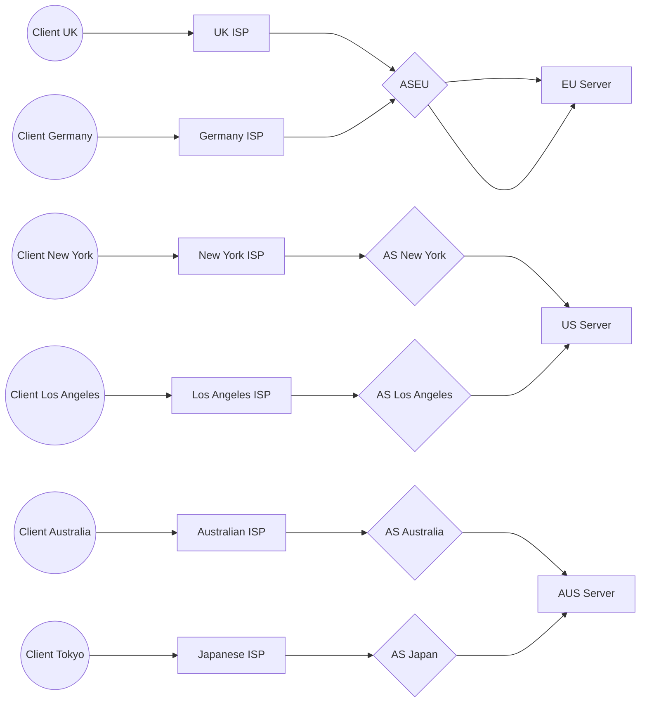

# Introduction to BGP

Let's start with the Wikipedia definition...

> Border Gateway Protocol (BGP) is a standardized exterior gateway protocol designed to exchange routing and reachability information among autonomous systems (AS) on the Internet. BGP is classified as a path-vector routing protocol, and it makes routing decisions based on paths, network policies, or rule-sets configured by a network administrator.

## The Problem BGP Solves

Let's consider what happens when a request for a website is made on your machine. This is going to be relatively high level, this isn't a terrible interview question 😀

1. First, a DNS request is made to resolve the hostname of the URL to an IP address.
2. Browser sends HTTP request to the IP address with a `Host: xyz` header.
3. Hopefully, the server responds back with some HTML.

Now, there's a lot of DNS servers on the internet and your own ISP definitely runs their own with a cache too. This means that you never need to wait too long, hopefully, to resolve a domain name to an IP address. However, where is the server that answers for that IP address?

The largest part of time requesting some HTML from a website is reaching out to that server with the HTTP request. These requests are strictly constrained by the laws of physics, notable the speed of light. So the further you are from the server that handles the IP address, the longer you wait for the bytes to start rolling down the fibre.

Let's take a look at some latency figures for requests made from London, New York, Los Angeles, Tokyo, and Sydney.

| Source      | London    | New York  | Los Angeles | Tokyo     | Sydney    |
| ----------- | --------- | --------- | ----------- | --------- | --------- |
| London      | -         | 69.799ms  | 139.987ms   | 235.9ms   | 270.608ms |
| New York    | 69.87ms   | -         | 64.672ms    | 176.865ms | 207.83ms  |
| Los Angeles | 140.173ms | 64.802ms  | -           | 107.849ms | 162.371ms |
| Tokyo       | 235.911ms | 176.956ms | 107.89ms    | -         | 136.997ms |
| Sydney      | 270.59ms  | 207.87ms  | 162.205ms   | 136.907ms | -         |

[**Source**](https://wondernetwork.com/pings/): https://wondernetwork.com/pings/

As you can see, as the distance between our source and destination increases - so does our latency.

While these figures aren't huge, they make a huge difference. Requests from Sydney to London are close to 300ms and websites can require hundreds of requests between the client and the server to display a single webpage.

This is why we push as much to the "edge" as possible, through Content Delivery Networks (CDNs) such as Cloudflare, Cloudfront, Fastly, and friends.

How do these CDNs work? Well, with BGP of course.

## How BGP Works

Let's now take a look at how requests to IP addresses are routed from our machines. Now, this may come as a surprise, but when you request an IP address - your machine doesn't actually know where that server is.

Much like finding directions to your favourite pizza place, you need to use a map. In the internet's case, our map is comprised of a bunch of Autonomous Systems (ASs) that route traffic around the internet.

These ASs each advertise their own IP prefixes to their peers that say "Hey, we know all IPv4 addresses that start with 1.2.3.0/24". Then when somebody within those ASs requests `1.2.3.4`, the AS can route them internally, if it is advertising the prefix, or through the peer if it is advertising it.

The more ASs you can peer with, the better you can route traffic around the internet.

## Lowering that Latency

So how do we improve our applications and websites for our customers at the further points from our servers? Well, we can deploy more servers to more locations. This is the part that most people are comfortable with, however routing traffic to these servers has been rather cumbersome with cloud computing because most clouds don't allow you to embrace BGP yourselves.

With Equinix, we can. We can advertise a "Global IP" to their world-wide network of ASs and peers, meaning that we have more ASs close to our customers routing traffic to our infrastructure within their regions.

What does that look like?

