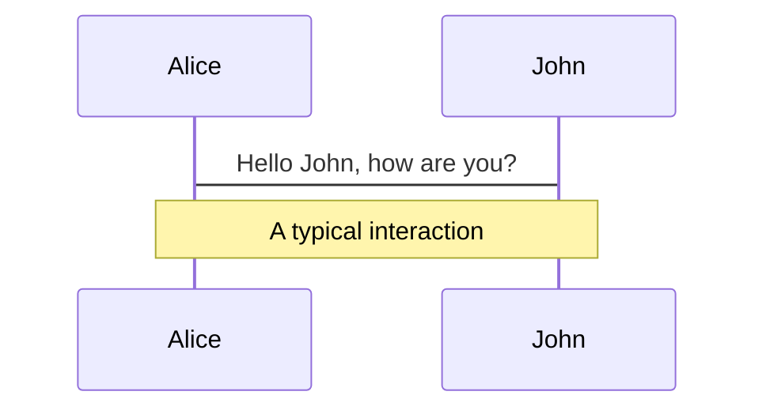
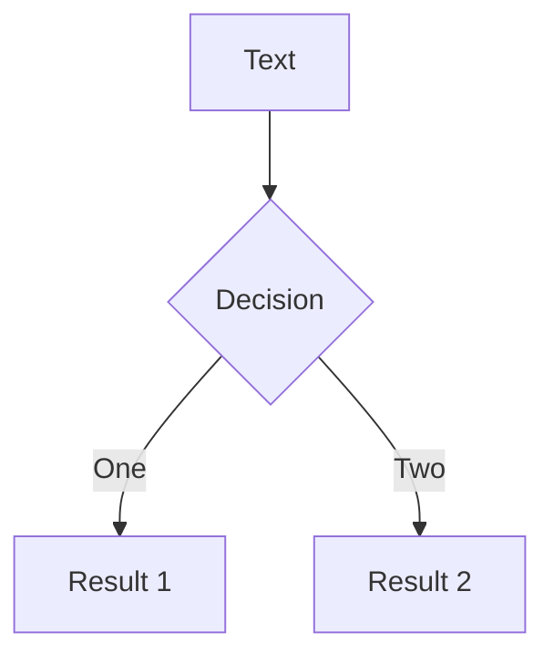
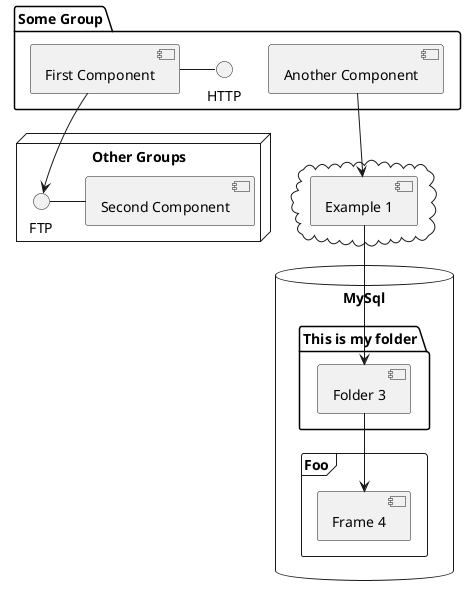

# Introduction to Kubernetes

## David Flanagan

### <carbon-logo-twitter /> rawkode

---

# Our Objectives for Today

## Understand the following

1. Kubernetes Control Plane
2. Kubernetes Primitives
3. Operating Stateful Workloads
4. Multi-Container Patterns

---

# How We Attain Them

1. Hands-on
2. Learn How to Learn
3. Ask Questions

---

# Setting Some Norms

1. I Don't Know
2. I Don't Understand

---

# What is Kubernetes?

Kubernetes, commonly stylized as K8s, is an open-source container orchestration system for automating software deployment, scaling, and management. Google originally designed Kubernetes, but the Cloud Native Computing Foundation now maintains the project.

## What does this mean?

- Manage containers across multiple hosts
- Ensure those containers are running correctly
- Ensure those containers can work together as a single unit.
- Allow those containers can scale independently
- Enforce CPU and memory constraints for applications
- ~~Run containers securely~~

---

# How does it work?

Declarative Configuration

- We describe Kubernetes resources in YAML
- Kubernetes has "controllers" that monitor for changes and "reconcile"
- Kubernetes is **eventually consistent**
  - Eventually consistent sometimes means never consistent
- "Simple" CRUD API

---

# Kubernetes Control Plane

Kubernetes is a distributed system for running distributed systems

## Control Plane

- API Server
- Controller Manager
- Scheduler

## Worker Plane

- Kubelet
- Container Network Interface
- Container Runtime Interface
- Container Storage Interface

---
layout: cover
background: https://64.media.tumblr.com/00d64c8e43cdd38883ab26ed7926f2c3/7a5e3920b4ee99e0-f6/s540x810/def30630aeebce028668834bb15d2e8a41ca70f4.gif
---
# We don't talk about etcd

---

# API Server

How we communicate with Kubernetes

Everytime you run a `kubectl` command, you're communicating directly with the Kubernetes API server.

It takes your instructions and:

1. writes the desired state to etcd.
2. reads from etcd

---

# Controller Manager / Controllers

Controller Manager is a supervisor for many other controllers

Everytime the desired state is modified in etcd, events are emitted and picked up by the controllers.

They're state machines that work out what needs to happen for the desired state to be realised.

---

# Scheduler

Where should we run our workloads?

Whenever our desired state changes and we need a new pod to be created, the scheduler is responsible for decided where that pod should run.

Things that can influence where a pod will be scheduled include, but not limited to:

- CPU / Memory constraints
- Node topology
- Architecture
- Storage and HDD/SSD classes
- Taints and tolerations
- More!

---

# Kubelet

Let's get to work!

Once something is scheduled, we need that workload to be created on the node.

The Kubelet is a process that runs on every node within your cluster and handles all that plumbing.

- Works with CNI to create IP address
- Works with CSI to provision any volumes
- Works with the CRI to create containers
- Responsible for running container based checks
- Responsible for ensuring containers are restarted should they fail checks


---

# Pods

- Share network namespace
  - IP address / binds
- Share PID namespace
  - PID 1
- Share mount namespace
  - volumes

---

Hover on the bottom-left corner to see the navigation's controls panel, [learn more](https://sli.dev/guide/navigation.html)

### Keyboard Shortcuts

|                                                     |                             |
| --------------------------------------------------- | --------------------------- |
| <kbd>right</kbd> / <kbd>space</kbd>                 | next animation or slide     |
| <kbd>left</kbd>  / <kbd>shift</kbd><kbd>space</kbd> | previous animation or slide |
| <kbd>up</kbd>                                       | previous slide              |
| <kbd>down</kbd>                                     | next slide                  |

<!-- https://sli.dev/guide/animations.html#click-animations -->

<p v-after class="absolute bottom-23 left-45 opacity-30 transform -rotate-10">Here!</p>

---
layout: image-right
image: https://source.unsplash.com/collection/94734566/1920x1080
---

# Code

Use code snippets and get the highlighting directly![^1]

```ts {all|2|1-6|9|all}
interface User {
  id: number
  firstName: string
  lastName: string
  role: string
}

function updateUser(id: number, update: User) {
  const user = getUser(id)
  const newUser = { ...user, ...update }
  saveUser(id, newUser)
}
```

<arrow v-click="3" x1="400" y1="420" x2="230" y2="330" color="#564" width="3" arrowSize="1" />

[^1]: [Learn More](https://sli.dev/guide/syntax.html#line-highlighting)

<style>
.footnotes-sep {
  @apply mt-20 opacity-10;
}
.footnotes {
  @apply text-sm opacity-75;
}
.footnote-backref {
  display: none;
}
</style>

---

# Components

<div grid="~ cols-2 gap-4">
<div>

You can use Vue components directly inside your slides.

We have provided a few built-in components like `<Tweet/>` and `<Youtube/>` that you can use directly. And adding your custom components is also super easy.

```html
<Counter :count="10" />
```

<!-- ./components/Counter.vue -->
<Counter :count="10" m="t-4" />

Check out [the guides](https://sli.dev/builtin/components.html) for more.

</div>
<div>

```html
<Tweet id="1390115482657726468" />
```

<Tweet id="1390115482657726468" scale="0.65" />

</div>
</div>

<!--
Presenter note with **bold**, *italic*, and ~~striked~~ text.

Also, HTML elements are valid:
<div class="flex w-full">
  <span style="flex-grow: 1;">Left content</span>
  <span>Right content</span>
</div>
-->


---
class: px-20
---

# Themes

Slidev comes with powerful theming support. Themes can provide styles, layouts, components, or even configurations for tools. Switching between themes by just **one edit** in your frontmatter:

<div grid="~ cols-2 gap-2" m="-t-2">

```yaml
---
theme: default
---
```

```yaml
---
theme: seriph
---
```


</div>

Read more about [How to use a theme](https://sli.dev/themes/use.html) and
check out the [Awesome Themes Gallery](https://sli.dev/themes/gallery.html).

---
preload: false
---

# Animations

Animations are powered by [@vueuse/motion](https://motion.vueuse.org/).

```html
<div
  v-motion
  :initial="{ x: -80 }"
  :enter="{ x: 0 }">
  Slidev
</div>
```

<div class="w-60 relative mt-6">
  <div class="relative w-40 h-40">
    
    
    
  </div>

  <div
    class="text-5xl absolute top-14 left-40 text-[#2B90B6] -z-1"
    v-motion
    :initial="{ x: -80, opacity: 0}"
    :enter="{ x: 0, opacity: 1, transition: { delay: 2000, duration: 1000 } }">
    Slidev
  </div>
</div>

<!-- vue script setup scripts can be directly used in markdown, and will only affects current page -->
<script setup lang="ts">
const final = {
  x: 0,
  y: 0,
  rotate: 0,
  scale: 1,
  transition: {
    type: 'spring',
    damping: 10,
    stiffness: 20,
    mass: 2
  }
}
</script>

<div
  v-motion
  :initial="{ x:35, y: 40, opacity: 0}"
  :enter="{ y: 0, opacity: 1, transition: { delay: 3500 } }">

[Learn More](https://sli.dev/guide/animations.html#motion)

</div>

---

# LaTeX

LaTeX is supported out-of-box powered by [KaTeX](https://katex.org/).

<br>

Inline $\sqrt{3x-1}+(1+x)^2$

Block
$$
\begin{array}{c}

\nabla \times \vec{\mathbf{B}} -\, \frac1c\, \frac{\partial\vec{\mathbf{E}}}{\partial t} &
= \frac{4\pi}{c}\vec{\mathbf{j}}    \nabla \cdot \vec{\mathbf{E}} & = 4 \pi \rho \\

\nabla \times \vec{\mathbf{E}}\, +\, \frac1c\, \frac{\partial\vec{\mathbf{B}}}{\partial t} & = \vec{\mathbf{0}} \\

\nabla \cdot \vec{\mathbf{B}} & = 0

\end{array}
$$

<br>

[Learn more](https://sli.dev/guide/syntax#latex)

---

# Diagrams

You can create diagrams / graphs from textual descriptions, directly in your Markdown.

<div class="grid grid-cols-3 gap-10 pt-4 -mb-6">







</div>

[Learn More](https://sli.dev/guide/syntax.html#diagrams)

---
src: ./pages/multiple-entries.md
hide: false
---

---
layout: center
class: text-center
---

# Learn More

[Documentations](https://sli.dev) · [GitHub](https://github.com/slidevjs/slidev) · [Showcases](https://sli.dev/showcases.html)
